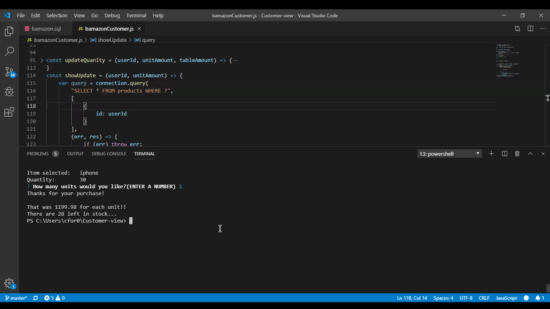

# Customer-view

*The use of this application is to create a customer view of 10 specific items from a `sql` database and update the database from the user purchases on the command line.*

## Built With
* node
* "npm inquirer"
* "mySQL"

## Overview
First function is a template literal of the table `products` so the customer can see what he might be interested in.
  *The first prompt question then asks which item he wishes to purchase.

I take the id of that item to `SELECT` the product and output onto the console the `name` and `quantity` for the customer. This prompts the second question to `SELECT, FROM, WHERE`  the targeted product for the `quantity` the customer wishes to purchase.(Cannot be more than the original quantity price.)

Lastly, this `UPDATES` the `quantity` of the selected product and shows the total `price` and updated quantity left in stock.
  

